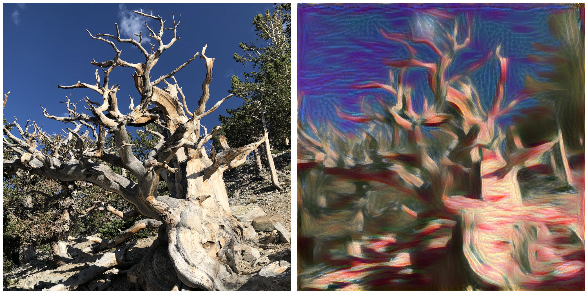
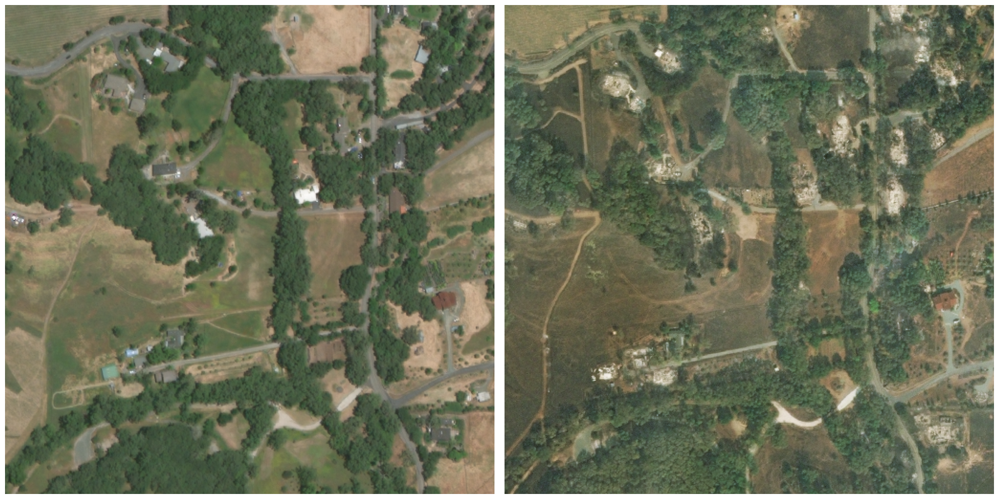
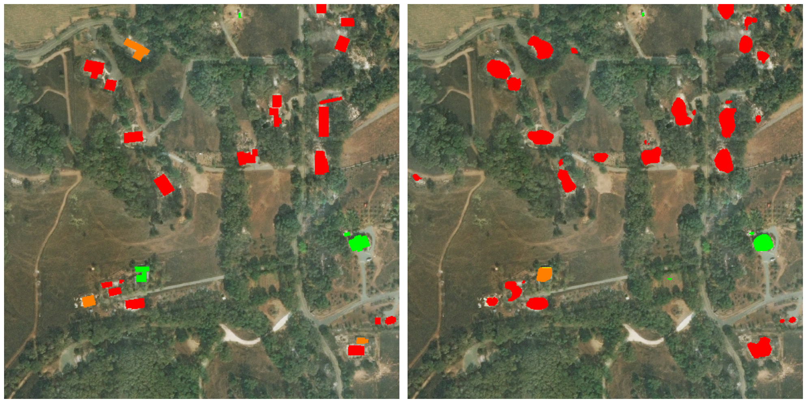

Below is some discussion of my past work along with links to source code and results. I have chosen not to discuss the proprietary work I've done during internships, although the highlights can be found on [my resume](/assets/resume.pdf).

## Neural Style Transfer

This is a personal side project I recently picked up. Neural style transfer extracts the style from one image (say, a Van Gogh painting) and applies it to another image (typically a photograph). The transfer is "neural" because a pre-trained neural network is used to understand the style and content of the two images.

[My implementation](https://github.com/mattdutson/style-transfer) is mostly based on [A Neural Algorithm of Artistic Style](https://arxiv.org/abs/1508.06576) (Gatys et al. 2015). An L-BFGS optimizer is used to minimize a loss function comprised of a style term, a content term, and an anti-noise term.

Here's an example. On the left is a photo I took of a bristlecone pine in Great Basin National Park. The right image reexpresses that image in the style of [The Scream](https://en.wikipedia.org/wiki/The_Scream) by Edvard Munch.

## Post-Disaster Building Damage Detection

As part of a computer vision class project Mehmet Demirel, Shri Shridhar, and I participated in the 2019 [xView2 competition](https://xview2.org/). The task was, given pre and post-disaster satellite images of some region, to localize buildings and estimate the damage they sustained during the disaster.

Our source code can be found [here](https://github.com/mattdutson/xview2). We trained a custom [U-Net](https://arxiv.org/abs/1505.04597) (Ronneberger et al. 2015) using a class-weighted loss. Our model performed competitively, even spending a couple of weeks on the competition leaderboard. The details of our approach and results can be found in [this report](assets/xview2_report.pdf).

Here's an example of a pre/post-disaster image pair.

These next images show the correct (left) and our model's predicted (right) building damage masks. The color scale ranges from green (no damage) to red (destroyed).

<!-- ## Synthetic Fiber Image Generation -->

<!-- ## Reconstruction of Cosmic Ray Geometry Using Cherenkov Backscattering -->
